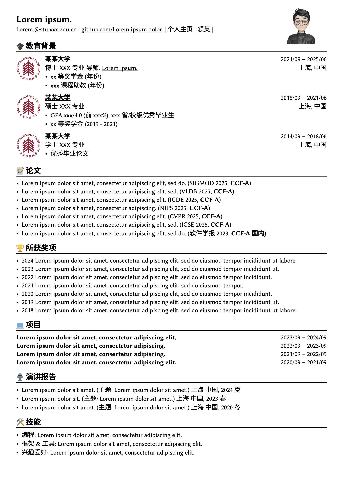
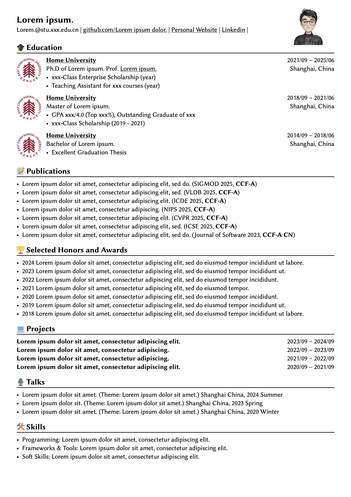

# Typst_CV_Template_Minimalism_Style
## Getting Started

Export the codes in `src` to https://typst.app/, then you can further design your own cv!

The effect is shown as follows.

| **中文示例** | **English Version** |
|:-----------:|:-------------------:|
|  |  |

## Acknowledge

I build this cv based on [Typst](https://typst.app/docs), which is a famous markup-based typesetting system.

Lastly, thanks to all committers who can help me improve this repo  :D

## Star History

<a href="https://star-history.com/#Wind-Gone/Typst_CV_Template_Minimalism_Style&Date">

  <picture>
    <source media="(prefers-color-scheme: dark)" srcset="https://api.star-history.com/svg?repos=Wind-Gone/Typst_CV_Template_Minimalism_Style&type=Date&theme=dark" />
    <source media="(prefers-color-scheme: light)" srcset="https://api.star-history.com/svg?repos=Wind-Gone/Typst_CV_Template_Minimalism_Style&type=Date" />
    
  </picture>

</a>

